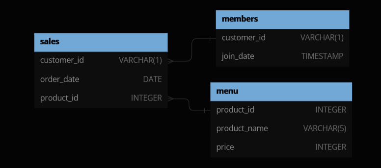

# Dannys Dinner
<p align="center">
    
</p>

## Problem Statement

Danny has requested that we utilize the provided business data to generate queries aimed at understanding buying patterns, expenditure trends, favorite items, and more. He intends to leverage this information to improve promotional strategies, enhance customer care, and drive overall business performance.

Danny has provide us with three datasets: ${\color{blue}sales,menu,members}$

You can inspect the Entity-Relatonship in the diagram below:

<p align="center">
    
</p>

All these queries were executed utilizing the following Relational Database Management System (RDBMS): **${\color{red}mysql}$**

---

#### 1.- What is the total amount each customer spent at the restaurant?

 ${\color{lightblue}QUERY:}$

```sql
SELECT sales.customer_id, SUM(menu.price) as Total 
FROM sales JOIN menu
ON sales.product_id = menu.product_id
GROUP BY sales.customer_id
ORDER BY Total DESC;
```
 ${\color{lightblue}DESCRIPTION:}$
 
- Use an **INNER JOIN** to relate sales-menu tables as we need *sales.customer_id* and *menu.price*.
- **SUM** over *menu.price* and **GROUP BY** *sales.customer_id* to know total money spended by each customer.

${\color{lightblue}OUTPUT:}$
  
| customer_id | Total |
|-------------|-------|
| A           | 76    |
| B           | 74    |
| C           | 36    |    

#### 2.- How many days has each customer visited the restaurant?

---

${\color{lightblue}QUERY:}$

```sql
SELECT customer_id,COUNT(DISTINCT order_date) AS Visits
FROM sales 
GROUP BY customer_id;
```
${\color{lightblue}DESCRIPTION:}$

- **COUNT** over the **DISTINCT** *sales.order_date* in sales table as a customer could buy different items the same day.
- **GROUP BY** sales.customer_id to obtain the total visits per client.

${\color{lightblue}OUTPUT:}$

| customer_id | Total |
|-------------|-------|
| A           | 4     |
| B           | 6     |
| C           | 2     |

---

#### 3.- What was the first item from the menu purchased by each customer?

${\color{lightblue}QUERY:}$
```sql 
WITH ordered AS(
    SELECT sales.customer_id,sales.order_date,menu.product_name,
    DENSE_RANK() OVER (PARTITION BY sales.customer_id ORDER BY sales.order_date ASC) as ranking
    FROM sales INNER JOIN menu
    ON sales.product_id = menu.product_id
)

SELECT customer_id,product_name as FIRST_ITEM
FROM ordered
WHERE ranking=1
GROUP BY customer_id,product_name; 

```
${\color{lightblue}DESCRIPTION:}$

- Use a CTE (Common Table Expression) to create the ordered table. In this table use window function using **OVER** applying a **DENSE_RANK()** in the sliding window.
- 3.- **PARTITION_BY** is used to partition the window over the *sales.customer_id* and **ORDER BY** is used to order by *sales.order_date* in ascendant mode(first item will be the oldest date). This will allow to rank every *sales.order_date* with corresponding item for each customer.
- Use the outer query to select the item in *ordered* table which has the first ranking for each client using **WHERE ranking=1** and **GROUP BY** customer_id,product_name.

${\color{lightblue}OUTPUT:}$

| customer_id | FIRST_ITEM |
|-------------|------------|
| A           | sushi      |
| A           | curry      |
| B           | curry      |
| C           | ramen      |

Since the *sales* table only records the *order_date* with day precision, it doesn't specify the order in which multiple items were purchased on the same day. Therefore, this query allows for multiple products to be attributed to a single client.

---

#### 4.- What is the most purchased item on the menu and how many times was it purchased by all customers?

${\color{lightblue}QUERY:}$
```sql
SELECT menu.product_name,COUNT(sales.product_id) AS MOST_PURCHASED
FROM sales INNER JOIN menu
ON sales.product_id = menu.product_id
GROUP BY menu.product_name
ORDER BY MOST_PURCHASED DESC
LIMIT 1;
```
${\color{lightblue}DESCRIPTION:}$

- Use **INNER JOIN** over *sales* and *menu* tables to relate the product names and the times they were purchased.
- Use **COUNT** to count every time an item was purchased on *sales* table and **GROUP BY** the product name.
- **ORDER** the items by the times it was purchased in **DESC** order and **LIMIT** the result table to the first item.

${\color{lightblue}OUTPUT:}$

| product_name | MOST_PURCHASED |
|--------------|----------------|
| ramen        | 8              |  

---

#### 5.- Which item was the most popular for each customer?

${\color{lightblue}QUERY:}$

```sql
WITH popular AS (
    SELECT sales.customer_id,menu.product_name, 
    COUNT(sales.product_id) AS order_count,
    DENSE_RANK() OVER (PARTITION BY sales.customer_id ORDER BY COUNT(sales.customer_id) DESC) AS ranked
    FROM menu INNER JOIN sales
    ON menu.product_id = sales.product_id
    GROUP BY sales.customer_id, menu.product_name
)

SELECT 
  customer_id, 
  product_name, 
  order_count
FROM popular
WHERE ranked = 1;
```
${\color{lightblue}DESCRIPTION:}$

- Utilize a Common Table Expression (CTE) to generate the *popular* table. Within this CTE, employ an **INNER JOIN** to establish a relationship between the *menu* and *sales* tables.
- Apply the **DENSE_RANK** function to the sliding windows formed by the **OVER** function. These windows are created by partitioning according to *sales.customer_id* using **PARTITION BY** and ordering the results by *sales.customer_id* in descending mode. This allows us to rank each product purchased by each customer based on its frequency of purchase.
- **COUNT** the occurrences in the *sales.product_id* column and **GROUP BY** the results by *sales.customer_id* and *menu.product_name*.
- In the outer query, **SELECT** *customer_id*, *product_name*, and *order_count* from the *popular* table and filter the results using **WHERE ranked = 1**. This ensures that only products ranked first in the *popular* table are selected.

 ${\color{lightblue}OUTPUT:}$

| customer_id | product_name | order_count |
|-------------|--------------|-------------|
| A           | ramen        | 3           |
| B           | curry        | 2           |
| B           | sushi        | 2           |
| B           | ramen        | 2           |
| C           | ramen        | 3           |

- As we use **DENSE_RANK()** more than one item can be ranked as the most purchased item for each customer. B client buy the same amount of curry,sushi and ramen! He/She really likes food!.

---

#### 6.- Which item was purchased first by the customer after they became a member?

${\color{lightblue}QUERY:}$

```sql
WITH ordered_date as(
    SELECT DISTINCT sales.customer_id,
    NTH_VALUE(product_id,1) OVER (PARTITION BY sales.customer_id ORDER BY sales.order_date ASC) as first
    FROM sales INNER JOIN members
    ON sales.customer_id = members.customer_id
    WHERE sales.order_date >= members.join_date
)

SELECT ordered_date.customer_id,menu.product_name
FROM ordered_date INNER JOIN menu ON ordered_date.first = menu.product_id;
```
${\color{lightblue}DESCRIPTION:}$

- Establish a Common Table Expression (CTE) named *ordered_date*. Utilize an **INNER JOIN** to establish a relationship between the sales and members tables. Employ the **NTH_VALUE()** function to retrieve the first item obtained in the *sales.product_id* column within the sliding windows created by **OVER**.
- Utilize the **PARTITION BY** function to partition the data by *sales.customer_id* and order it by *sales.order_date* in ascending mode.
- The **INNER JOIN** is performed on fields where not only the *customer_id matches*, but also where the *sales.order_date* is greater than or equal to the *members.join_date*. This ensures that only items purchased after the customer acquired a membership at Danny's Diner are included.
- The outer query is solely intended to relate the *ordered_date.product_id* to *menu.product_name*.

${\color{lightblue}OUTPUT:}$

| customer_id | first |
|-------------|-------|
| B           | curry |
| A           | sushi |

- These results may vary, as the original table allows for multiple items to be purchased on the same day. For example, if customer A purchased sushi and ramen on their first day after becoming a member, both items could be included in the resulting query.

---

#### 7.- Which item was purchased just before the customer became a member?

${\color{lightblue}QUERY:}$

```sql
WITH ordered_date as(
    SELECT DISTINCT sales.customer_id,
    NTH_VALUE(product_id,1) OVER (PARTITION BY sales.customer_id ORDER BY sales.order_date DESC) as first
    FROM sales INNER JOIN members
    ON sales.customer_id = members.customer_id
    WHERE sales.order_date < members.join_date
)

SELECT ordered_date.customer_id,menu.product_name
FROM ordered_date INNER JOIN menu ON ordered_date.first = menu.product_id;
```
${\color{lightblue}DESCRIPTION:}$

- Establish a Common Table Expression (CTE) named *ordered_date*. Utilize an **INNER JOIN** to establish a relationship between the sales and members tables. Employ the **NTH_VALUE()** function to retrieve the first item obtained in the *sales.product_id* column within the sliding windows created by **OVER**.
- Utilize the **PARTITION BY** function to partition the data by *sales.customer_id* and order it by *sales.order_date* in descending mode.
- The **INNER JOIN** is performed on fields where not only the *customer_id matches*, but also where the *sales.order_date* is less than the *members.join_date*. This ensures that only items purchased after the customer acquired a membership at Danny's Diner are included.
- The outer query is solely intended to relate the *ordered_date.product_id* to *menu.product_name*.

${\color{lightblue}OUTPUT:}$

| customer_id | product_name |
|-------------|--------------|
| A           | sushi        |
| B           | sushi        |

---

#### 8.- What is the total items and amount spent for each member before they became a member?

${\color{lightblue}QUERY:}$

```sql
WITH filter_date as( 
    SELECT sales.customer_id,sales.order_date,sales.product_id 
    FROM sales INNER JOIN members 
    ON sales.customer_id = members.customer_id 
    WHERE sales.order_date < members.join_date
    order by customer_id,members.join_date
)

SELECT filter_date.customer_id,
COUNT(filter_date.product_id) as Total_Items,
SUM(menu.price) as Total_Price
FROM filter_date INNER JOIN menu
ON filter_date.product_id = menu.product_id
GROUP BY filter_date.customer_id;
```

${\color{lightblue}DESCRIPTION:}$

- First, create a CTE called filter_date. Apply an **INNER** JOIN to sales and members to relate product names and customers. This **INNER JOIN** is applied on *customer_id* match fields and select only *sales.order_date* less than *members.join_date* to get orders before client become a member.
-  On the outer query make another **INNER JOIN** between *filter_date* and *menu* tables.
- **COUNT** the total purchased items by his product_id and **SUM** over their prices.
- **GROUP BY** the aggregatted functions **COUNT** and **SUM** functions by *customer_id*.

${\color{lightblue}OUTPUT:}$

| customer_id | Total_Items | Total_Price |
|-------------|-------------|-------------|
| B           | 3           | 40          |
| A           | 2           | 25          |

---

#### 9.-  If each $1 spent equates to 10 points and sushi has a 2x points multiplier — how many points would each customer have?

${\color{lightblue}QUERY:}$

```sql
WITH pts as (
    SELECT sales.customer_id,
    CASE
        WHEN sales.product_id = 1 THEN menu.price*20
        ELSE menu.price*10 END AS points 
    FROM sales INNER JOIN menu
    ON sales.product_id = menu.product_id
)

SELECT pts.customer_id, SUM(pts.points) as Points
FROM pts
GROUP BY pts.customer_id
ORDER BY Points DESC;
```
${\color{lightblue}DESCRIPTION:}$
- Create a Common Table Expression (CTE) named pts. Utilize an **INNER JOIN** to link prices with each purchased item. This query will introduce a new field called *points*, where the points awarded for each purchase will be stored using a **CASE** clause to handle different items and promotions.
- On the outer query use **SUM** to sum all the points obtained by each customer.

${\color{lightblue}OUTPUT:}$

| customer_id | Points |
|-------------|--------|
| B           | 940    |
| A           | 860    |
| C           | 360    |  

---

#### 10.-  In the first week after a customer joins the program (including their join date) they earn 2x points on all items, not just sushi — how many points do customer A and B have at the end of January?

${\color{lightblue}QUERY:}$

```sql
WITH dates AS(
    SELECT customer_id, join_date,
    DATE_ADD(join_date, INTERVAL 6 DAY) AS valid_date
    from members
)

SELECT 
  sales.customer_id, 
  SUM(CASE
    WHEN menu.product_name = 'sushi' THEN 2 * 10 * menu.price
    WHEN sales.order_date BETWEEN dates.join_date AND dates.valid_date THEN 2 * 10 * menu.price
    ELSE 10 * menu.price END) AS points
FROM sales
INNER JOIN dates
  ON sales.customer_id = dates.customer_id  
  AND sales.order_date <= '2021-01-31'
  AND sales.order_date >= '2021-01-01'
INNER JOIN menu
  ON sales.product_id = menu.product_id
GROUP BY sales.customer_id;
```
${\color{lightblue}DESCRIPTION:}$

- Define a Common Table Expression (CTE) named *dates*, which selects the *customer_id*, *join_date*, and calculates a *valid_date* by adding 6 days to the *join_date*. This CTE helps determine the validity period for customer memberships.

- The main query then selects the *customer_id* from the sales table and calculates the points earned by each customer using a **SUM** function with a **CASE** clause. It evaluates different conditions:

    - If the purchased item is 'sushi', the customer earns double points (2 * 10 * menu.price).

    - If the order date falls within the validity period of the customer's membership (as defined in the dates CTE), the customer also earns double points.

    - Otherwise, the customer earns regular points (10 * menu.price).

- It performs an **INNER JOIN** with the dates CTE based on matching *customer_id values*. Additionally, it filters the sales table to include only orders placed between '2021-01-01' and '2021-01-31'. This ensures that only January sales data is considered.

- Finally, it joins the menu table to retrieve information about the purchased items, linking it with the sales table based on the *product_id*.

- The results are grouped by *customer_id*, aggregating the total points earned by each customer.

  ${\color{lightblue}OUTPUT:}$

| customer_id | Points |
|-------------|--------|
| B           | 820    |
| A           | 1370   |

- Disclaimer about excercise 10: According to my calculations the result must be 720 for B, and 1270 for A. There must be an error in my Query. Im considering only January dates and the double points only the week after they join (considering the first day, thats why im only adding 6 days in the query). Feel free to tell me about it :).
